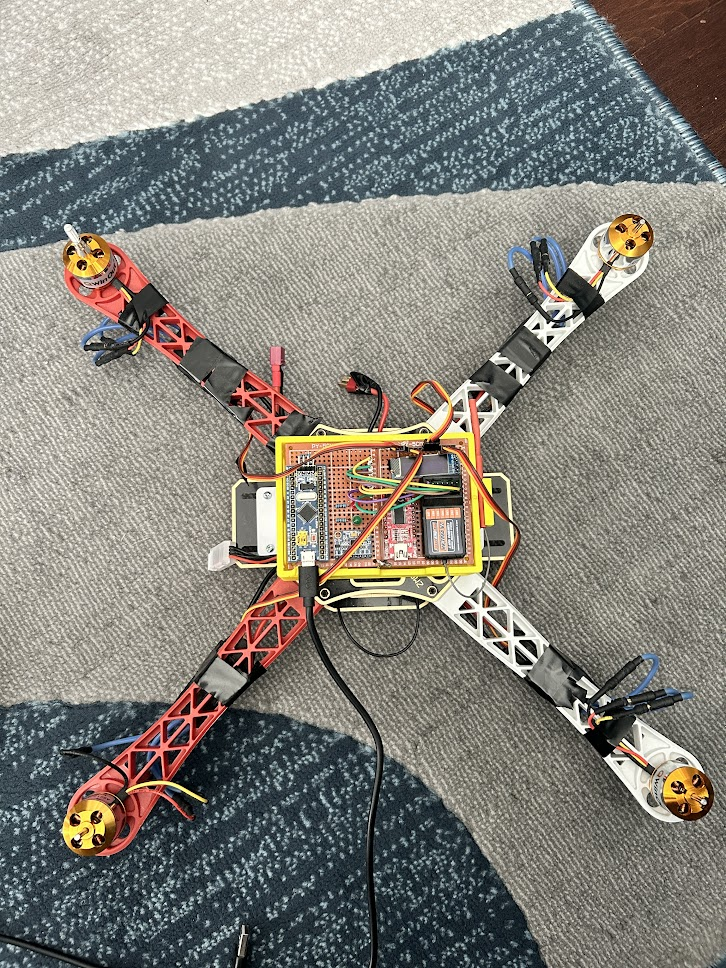

# bluePillQuad
A drone flight controller using the STM32F103 Blue Pill

## Components

This drone uses a generic F450 drone frame as the main platform. The motors are four (4) 1000 KV rated motors from aliexpress. 
The brain of the drone is the STM32F103 "Blue pill" controller pictured above. The drone also uses a generic MPU6050 module for its orientation measurements. The drone also uses some LEDs for error signals as well as a generic SSD1306 OLED display module. 

## Development Platform

I decided to use platformIO for developing the code for this project, with the arduino and stm32duino tools. 

https://github.com/h3khaira/bluePillQuad/blob/93b4a383c6f1992de7543bbd68de41c283f07ee7/platformio.ini#L10C1-L30C34

